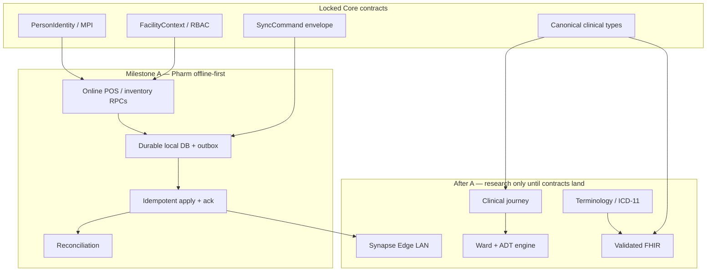

# Implementation dependency graph

Milestone order is product truth, not a calendar. Keep `main` buildable after every increment.

## Dependency rules

1. Offline Sync consumes `SyncCommand`. It does not redesign identity or inventory RPCs.
2. Pharmacy domain owner owns POS, FEFO, receive, adjust, reverse, receipts, and transfer execution. It does not invent a second outbox.
3. Clinical journey may not start operational UI until Encounter / MedicationRequest contracts are used, not copied.
4. FHIR maps to `@synapse/interop` canonical types. No parallel resource model.
5. Edge reuses the same sync protocol; it is a deployment of Core, not a fork.
6. Public health, specialty packs, and patient glucose wait until clinical event contracts are stable.

## Safe parallel now

| Stream | Owner | May edit | Must not edit |
|---|---|---|---|
| Durable offline persistence | offline-sync | Expo/web local store, outbox apply API, tests | `complete_pharmacy_sale`, identity SQL |
| Online transfer execution | pharmacy-domain | transfer RPC + API after Core SQL review | sync-contract, identity, MPI |
| Expo a11y / POS UX | accessibility + expo | UI only; call existing APIs | migrations, RPCs |
| Core/Grid design | core-grid | docs/ADR only until Lead Architect opens schema | live SQL |
| Terminology / FHIR / Edge / journey research | named owners | docs under their folder | packages/db inventory, identity SQL |

## Unsafe parallel

- Two agents on the same migration
- Two identity models
- Two sync protocols
- Competing FHIR Patient vs Person mappings
- Any last-write-wins inventory merge
