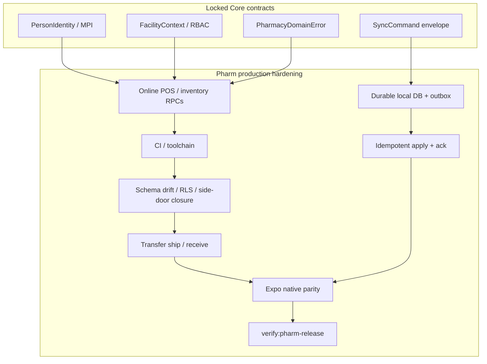

# Implementation dependency graph

Keep `main` buildable after every increment. SYNAPSE Pharm is the release target; hospital modules stay research/docs unless a tiny Core correction is required.

## Open PR disposition (2026-08-22)

| PR | Branch | Disposition |
|---|---|---|
| #38 | `cursor/orchestrator-milestone-a-e7a0` | **Integrate here** (contracts). Do not in-place-edit shipped SQL. |
| #40 | `cursor/pharm-transfers-e7a0` | Integrate after this PR (transfer execute RPCs). |
| #41 | `cursor/pharm-offline-sync-e7a0` | Integrate after this PR (SQLite / apply). |
| #36 | `cursor/pharm-offline-pos-5fb7` | **Do not merge** competing `packages/offline`. Salvage tests onto SyncCommand. |
| #34 | `cursor/pharm-inventory-authority-hardening-8cc3` | **Superseded** — already on `main` via pilot. |
| #39 | clinical research | Out of scope for Pharm release. |

## Unsafe parallel

- Two agents on the same migration
- Two identity models
- Two sync protocols (`packages/offline` vs `SyncCommand`)
- Any last-write-wins inventory merge
- Direct `pharmacy_products.quantity` writes
