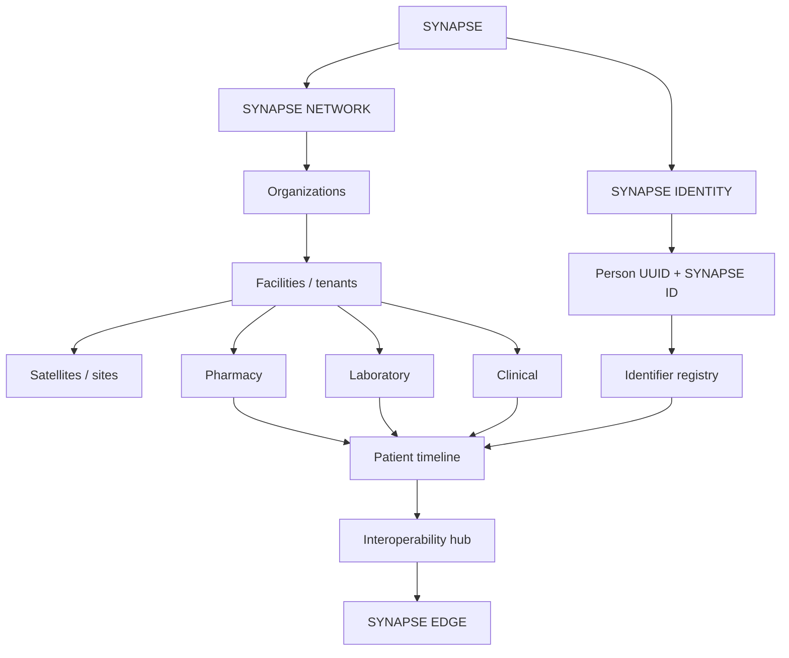

# SYNAPSE network architecture

Status: **foundations implemented** (2026-08-17). Pharmacy remains the first production module.
This document is the living architecture for identity, facilities, interoperability and accessibility.

## Product philosophy

If a facility has no system, SYNAPSE becomes the system.  
If a facility already has a system, SYNAPSE connects to it.  
If a facility has a partial system, SYNAPSE fills the gaps.  
Every person keeps one persistent SYNAPSE identity. Hospitals keep their local identifiers.

## KEEP / EXTEND / REFACTOR / DEPRECATE / CREATE

| Area | Decision |
|------|----------|
| `tenants` as facilities | **KEEP** + **EXTEND** (`organization_id`, `facility_mode`, `parent_tenant_id`) |
| `organizations` | **CREATE** |
| `pharmacy_stores` as pharmacy sites | **KEEP** + **EXTEND** (address, warehouse, parent store) |
| Custom JWT `@synapse/auth` | **KEEP**; optional `organization_id` / `site_id` claims |
| Capability lattice + pharmacy capabilities | **KEEP** + **EXTEND** with `staff_scope_assignments` |
| `patients` (facility chart) | **KEEP**; add nullable `person_id` — do not treat MRN as the person |
| `pharmacy_customers` | **KEEP**; add nullable `person_id` |
| `persons`, `person_identifiers` | **CREATE** |
| `generate_synapse_id` | **EXTEND** to `SYN-CC-XXXXXXXX` + check character |
| `patient_timeline_events` | **EXTEND** (`person_id`, `provenance`, `site_id`; `patient_id` nullable) |
| Insurance claims / payer contracts | **KEEP**; **CREATE** `insurance_memberships` on the person |
| `patient_consents` | **KEEP** (encounter/module); **CREATE** `person_consents` (purpose/scope) |
| Pharmacy POS RPCs / inventory authority | **KEEP** — do not rewrite sell path |
| `@synapse/ui` | **EXTEND** from `cn()` into tokens + a11y primitives |
| OpenMRS/UgandaEMR adapters | **CREATE** interfaces only — no vendor coupling in core |
| Isolated per-module timelines | **DEPRECATE** as a direction; publish into `patient_timeline_events` |
| `product.quantity` as sellable truth | already **DEPRECATED** by inventory-authority work |

## Facility deployment modes

`facility_mode`: `NATIVE` | `CONNECTED` | `HYBRID` | `SATELLITE` | `COMMUNITY_ACCESS`

All modes share persons, identifiers, scoped RBAC, timeline and audit. Adapters differ; primitives do not.

## Identity

- Immutable id: `persons.id` (UUID)
- Human-readable id: `persons.synapse_id` (`SYN-UG-XXXXXXXX` + check char)
- Local ids live in `person_identifiers` namespaced by issuer organization **and** facility
- MPI scores matches; uncertain identities go to `identity_match_candidates`
- Merges retain every identifier (`status = merged`) and write `identity_merge_events`
- `shouldAutoMerge()` is always false in application code

## Scoped RBAC

Authorization is **role + scope**. A pharmacist scoped to Fort Portal Main Pharmacy cannot open Branch B. A regional manager scoped to the organization can aggregate sites.

Enforced in:

- `staff_scope_assignments` + RLS
- `@synapse/db/scope` (`canAccessResource`, `assertSiteAllowed`)
- APIs that already isolate by `tenant_id` from the JWT (never from the body)

## Accessibility

Target: **WCAG 2.2 Level AA** at the design-system layer.

- Contrast-tested tokens in `@synapse/ui`
- Status is text + icon, never color alone
- POS optional shortcuts (F2–F9) do not replace Tab/Enter
- Expo controls expose `accessibilityLabel` / `accessibilityRole` / `accessibilityState`

## Interoperability

`@synapse/interop` translates vendor payloads into the SYNAPSE canonical model. Preference order:

Official API → FHIR → HL7 v2 → approved middleware → read-only database (last resort).

Analyzers must not connect to the public internet. The lab gateway talks accession numbers, then SYNAPSE resolves specimen → order → encounter → person.

## Offline / edge

`offline_mutation_outbox` is the shared sync contract. Web POS still refuses durable offline writes (`OfflineUnavailableError`) until the encrypted queue ships. Expo POS keeps a local cart draft and sale idempotency keys.

## Pharmacy first

Synapse Pharm consumes:

- person identity on customer create
- timeline publication when a sale is linked to a person/patient
- branch/satellite CRUD
- site assignment on staff (`store_id`)
- accessible POS + Expo controls
